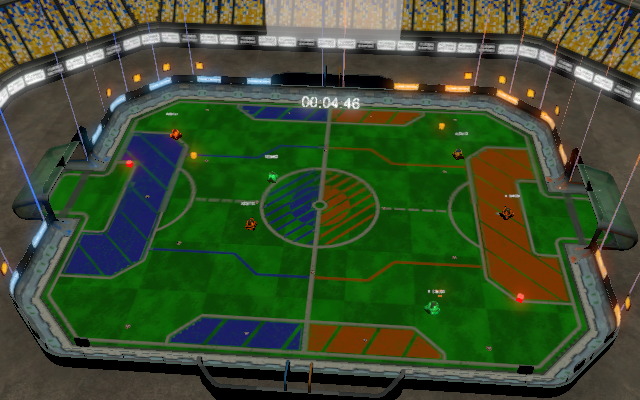

# Intro
This bot was an entry for Morgan Stanley's challenge at the 2018 hackathon "Do you have the GUTS" in Glasgow, UK. It scored the most points of all  participants during the final competition, but lost to an opponent successfully capturing "the snitch".

# Mission
Create a bot that is able to score the most points in the  game.

# Features
* Separated movement, turning and turret-turning logic
* Modified "waller" strategy that gives least chance to opponents to hit us
* Target scoring system, utilizing a mobility factor (how much an opponent moves)

# Challenges
* Limited and delayed state information (every 200/350ms)
* Limited server packet processing (50ms/packet)
* No knowledge of projectiles

# Future work
* Prediction algorithm
* Attempt to capture the snitch
* Pick up health packs when necessary